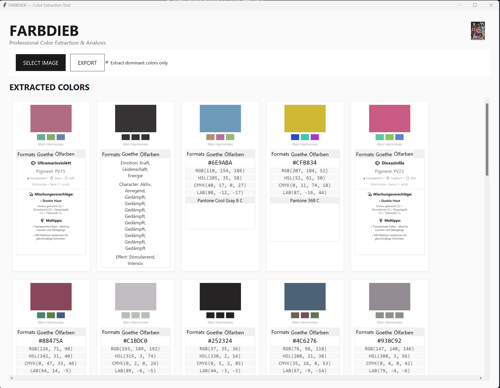

# FARBDIEB 🎨

**Professional Color Extraction & Analysis Tool**

A desktop application for extracting dominant colors from images and analyzing their psychological impact using **Goethe's Color Theory** and **Itten's Color Harmonies**.



## ✨ Features

### 🎯 **Core Functionality**
- **Smart Color Extraction** with K-means clustering
- **Multi-format Support** (JPG, PNG, BMP, GIF)
- **Responsive Swiss Design** interface
- **Real-time Image Analysis** with threading

### 🧠 **Color Psychology & Theory**
- **Goethe's Color Psychology** - Emotion, Character, Effect analysis
- **Itten's Color Harmonies** - Complementary, Triadic, Analogous colors
- **Pantone Color Matching** for professional workflows
- **5 Color Space Analysis** (HEX, RGB, HSL, CMYK, LAB)

### 📤 **Professional Export Options**
- **CSV** - For Excel & spreadsheet applications
- **JSON** - Complete analysis data for developers
- **Adobe ASE** - Adobe Swatch Exchange for Creative Suite
- **CSS Variables** - For web development
- **SCSS Variables** - For preprocessor workflows  
- **Figma Design Tokens** - For design system integration

### 🎛️ **User Experience**
- **Keyboard Shortcuts** (Ctrl+O, Ctrl+S, F1, F5)
- **Toast Notifications** for copy feedback
- **Hover Effects** and micro-interactions
- **High-DPI Support** for modern displays
- **Selectable & Copyable** color values

## 🚀 Quick Start

### Prerequisites
- Python 3.8+
- tkinter (usually included with Python)
- Required packages (see requirements.txt)

### Installation

```bash
# Clone the repository
git clone https://github.com/eg0pr0xy/farbdieb.git
cd farbdieb

# Install dependencies
pip install -r requirements.txt

# Run the application
python main.py
```

## 🎨 How to Use

1. **Launch FARBDIEB** - Run `python main.py`
2. **Select Image** - Click "SELECT IMAGE" or press `Ctrl+O`
3. **Analyze Colors** - Colors are automatically extracted and analyzed
4. **Explore Analysis** - View formats, Goethe psychology, and Itten harmonies
5. **Copy Colors** - Click any color value to select, double-click to copy
6. **Export Results** - Press `Ctrl+S` or click "EXPORT" for professional formats

## 🏗️ Architecture

```
farbdieb/
├── main.py              # Application entry point
├── gui.py               # Main GUI interface with Swiss Design
├── color_utils.py       # Color extraction algorithms
├── color_theory.py      # Goethe & Itten analysis engine
├── export_utils.py      # Professional export formats
├── pantone_data.py      # Pantone color matching database
├── requirements.txt     # Python dependencies
└── assets/              # Logo and preview images
```

## 🔬 Color Analysis Engine

### Goethe's Color Psychology
- **Emotion Analysis** - Warm/cool psychological impact
- **Character Assessment** - Color personality traits
- **Effect Evaluation** - Visual and emotional influence

### Itten's Color Harmonies
- **Complementary Colors** - 180° opposite on color wheel
- **Triadic Relationships** - 120° intervals for balance
- **Analogous Schemes** - 30° adjacent harmonious colors

## 🎛️ Keyboard Shortcuts

| Shortcut | Action |
|----------|--------|
| `Ctrl+O` | Open image |
| `Ctrl+S` | Export colors |
| `Ctrl+Q` | Quit application |
| `F1` | Show help |
| `F5` | Re-analyze current image |

## 📋 Export Formats

| Format | Use Case | File Extension |
|--------|----------|----------------|
| **CSV** | Excel, Numbers, Data Analysis | `.csv` |
| **JSON** | APIs, Web Development | `.json` |
| **Adobe ASE** | Photoshop, Illustrator | `.ase` |
| **CSS Variables** | Web Development | `.css` |
| **SCSS Variables** | Sass Preprocessing | `.scss` |
| **Figma Tokens** | Design Systems | `.json` |

## 🛠️ Technical Stack

- **GUI Framework**: tkinter with Swiss Design principles
- **Image Processing**: PIL (Pillow)
- **Color Analysis**: scikit-learn K-means clustering
- **Data Visualization**: matplotlib
- **Color Space**: Advanced HSL, CMYK, LAB conversions
- **Export Engine**: Custom SwatchExporter class

## 🎨 Design Philosophy

FARBDIEB follows **Swiss Design principles**:
- **Minimalism** - Clean, functional interface
- **Typography** - Segoe UI font hierarchy
- **Grid System** - Responsive column layout
- **Color Palette** - Professional off-white (#FAFAFA) background
- **Micro-interactions** - Subtle hover effects and animations

## 🧪 Dependencies

```txt
pillow>=9.0.0
scikit-learn>=1.0.0
matplotlib>=3.5.0
numpy>=1.21.0
```

## 📈 Performance

- **Multi-threading** for non-blocking UI during analysis
- **Optimized K-means** clustering for dominant color extraction
- **Efficient color space** conversions
- **Memory management** for large image processing

## 🔧 Development

### Project Structure
- **Modular Design** - Separated concerns (GUI, analysis, export)
- **Swiss Design System** - Consistent visual hierarchy
- **Error Handling** - Graceful degradation and user feedback
- **Cross-platform** - Windows, macOS, Linux support

### Contributing
1. Fork the repository
2. Create feature branch (`git checkout -b feature/amazing-feature`)
3. Commit changes (`git commit -m 'Add amazing feature'`)
4. Push to branch (`git push origin feature/amazing-feature`)
5. Open Pull Request

## 📜 License

This project is licensed under the MIT License - see the [LICENSE](LICENSE) file for details.

## 🙏 Acknowledgments

- **Johann Wolfgang von Goethe** - Color psychology theory
- **Johannes Itten** - Color harmony principles  
- **Swiss Design Movement** - Visual design inspiration
- **Pantone Inc.** - Professional color matching

## 📞 Support

- **Issues**: [GitHub Issues](https://github.com/eg0pr0xy/farbdieb/issues)
- **Discussions**: [GitHub Discussions](https://github.com/eg0pr0xy/farbdieb/discussions)

---

**Made with 🎨 and Swiss precision**
